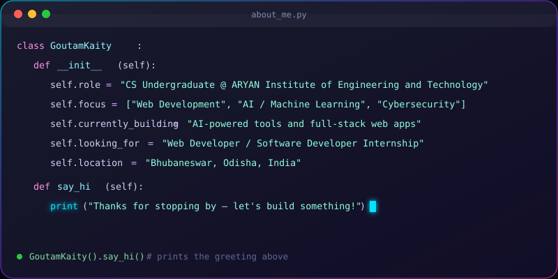

  

 

## 👋 About Me

 

- 🎓 B.Tech in Computer Science, ARYAN Institute of Engineering and Technology (2023 – 2027)
- 💼 Previously: AI Developer Intern @ **Acmegrade**, Web Developer Intern @ **VidyaVistara**
- 🧠 Interests: AI/ML, cybersecurity tooling, responsive web apps, REST APIs
- 📍 Based in Odisha, India · 📫 **goutamkaity142@gmail.com**

 

## 🛠️ Tech Stack

**Programming**
 

**Frontend**
 

**Backend & Database**
 

**AI / ML**
 

**Cybersecurity & Tools**
 

 

## 🪐 Interactive Skills Orbit

 

 

## 📊 GitHub Stats

 

## 🚀 Featured Projects

[AI-CareerGuidance](https://github.com/GOUTAM-op/AI-CareerGuidance) ·|· [Password-Testing](https://github.com/GOUTAM-op/Password-Testing) ·|· [E-Learning-Platform](https://github.com/GOUTAM-op/E-Learning-Platform)

 

## 🎓 Certifications

- **Full Stack Web Development Certification** — Coursera
  HTML5, CSS3, JavaScript, responsive design, frontend development
- **AI & Machine Learning Training** — Coursera & Google
  NumPy, Pandas, Scikit-learn, ML workflow fundamentals

 

## 🌐 Languages

`English` · `Hindi` · `Odia` · `Bengali`

 

### 👾 Pacman Game

<picture>
  <source media="(prefers-color-scheme: dark)" srcset="https://raw.githubusercontent.com/Pavithran-P12/ReadmePacman/output/pacman-contribution-graph-dark.svg">
  <source media="(prefers-color-scheme: light)" srcset="https://raw.githubusercontent.com/Pavithran-P12/ReadmePacman/output/pacman-contribution-graph.svg">
  
</picture>

 

## 📬 Let's Connect

  

  

