  

 

## 👋 About Me

- 🎓 B.Tech in Computer Science, ARYAN Institute of Engineering and Technology (2023 – 2027)
- 💼 Previously: AI Developer Intern @ **Acmegrade**, Web Developer Intern @ **VidyaVistara**
- 🧠 Interests: AI/ML, cybersecurity tooling, responsive web apps, REST APIs
- 📍 Based in Odisha, India · 📫 **goutamkaity7@gmail.com**

 

## 🛠️ Tech Stack

**Programming**
 

**Frontend**
 

**Backend & Database**
 

**AI / ML**
 

**Cybersecurity & Tools**
 

 

## 🪐 Interactive Skills Orbit

 
Hand-built animated SVG — hexagonal nodes orbiting a glowing core, three independent rotation speeds for depth.

 

## ⚡ Fun Fact

I enjoy building high-performance web systems, AI-powered applications, and cybersecurity tools that solve real-world problems.

---

## Stack

  
  
  
  
  

## GitHub Stats

  
   
 
  

  
  

  
  

## 📊 GitHub Stats

 

## 🐍 Contribution Snake

Generated automatically once a day by the GitHub Action in `.github/workflows/snake.yml` (see setup guide).

 

## 🏆 Trophies

 

## 🚀 Featured Projects

[AI-CareerGuidance](https://github.com/GOUTAM-op/AI-CareerGuidance) · [Password-Testing](https://github.com/GOUTAM-op/Password-Testing) · [E-Learning-Platform](https://github.com/GOUTAM-op/E-Learning-Platform)

Update these three links to match your exact repository URLs.

 

## 🎓 Certifications

- **Full Stack Web Development Certification** — Coursera
  HTML5, CSS3, JavaScript, responsive design, frontend development
- **AI & Machine Learning Training** — Coursera & Google
  NumPy, Pandas, Scikit-learn, ML workflow fundamentals

 

## 🌐 Languages

`English` · `Hindi` · `Odia` · `Bengali`

 

## 📬 Let's Connect

  

  

